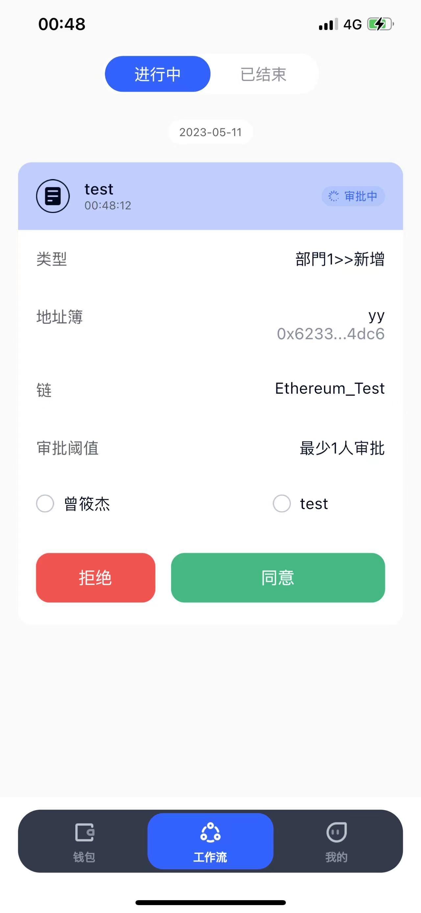

# 🎞 Workflow

SINOHOPE offers an approval workflow feature for transfers and adding addresses to the address book. This functionality enables different members within a team to collaboratively manage digital assets.

When a member initiates a transfer or adds an address to the address book, the process enters an approval workflow. This allows organization creators, administrators, and co-admins of relevant departments to review and approve the request. This feature promotes collaborative asset management and enhances security within the organization.

.png>)
